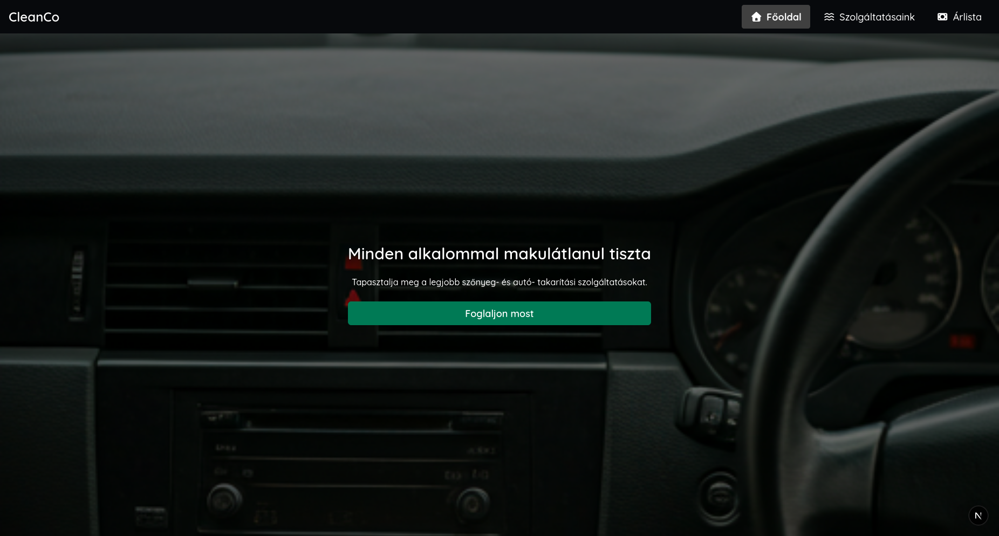

# 🧼 CleanCo Website

A modern, responsive **Next.js + React** web app for **CleanCo**, offering professional car, upholstery, and carpet cleaning services.

## 🚀 Features
- 🧽 Service listings with detailed info  
- 📅 Step-by-step booking form  
- 💰 Transparent pricing cards  
- 📞 Contact form and location map  
- 🌙 Clean, dark-themed responsive UI  

## 🛠️ Tech Stack
- [Next.js](https://nextjs.org/) – React framework  
- [React](https://react.dev/) – UI components  
- [Tailwind CSS](https://tailwindcss.com/) – Styling  
- [Framer Motion](https://www.framer.com/motion/) – Animations  

## 📸 Preview

## 📄 License

This project is open source under the MIT License.
